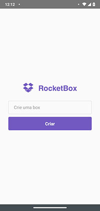
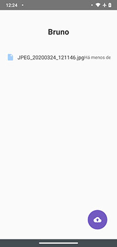
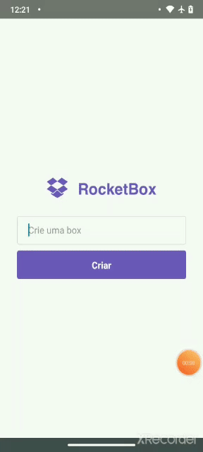

A mobile version of [Dropbox frontend](https://github.com/bhct/dropbox-frontend) builded using [React Native version 0.59.4](https://reactnative.dev/docs/0.59/getting-started).
This project is connected to [Dropbox API](https://github.com/bhct/dropbox-api).

## How can I run it?

Clone the project. Rename the file **.env.sample** to **.env**.
In the project directory, you can run:

### `npm install`

or

### `yarn install`

and than run:

### `react-native run-android`

or

### `react-native run-ios`

Than you will get this:

